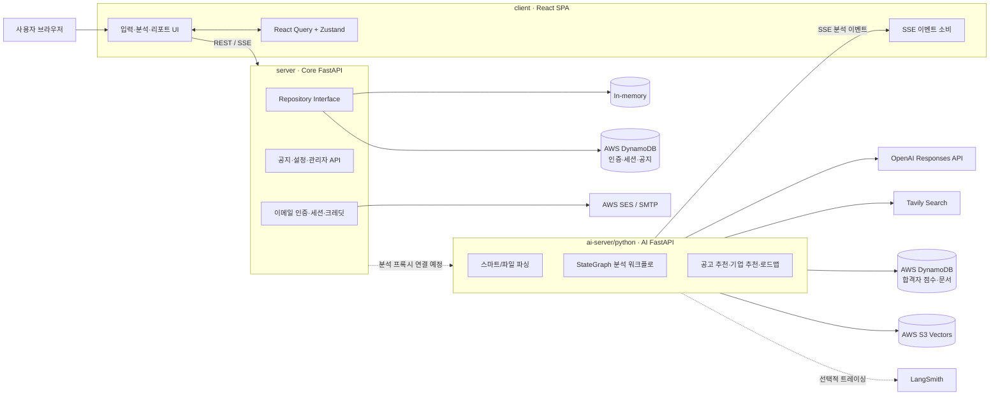
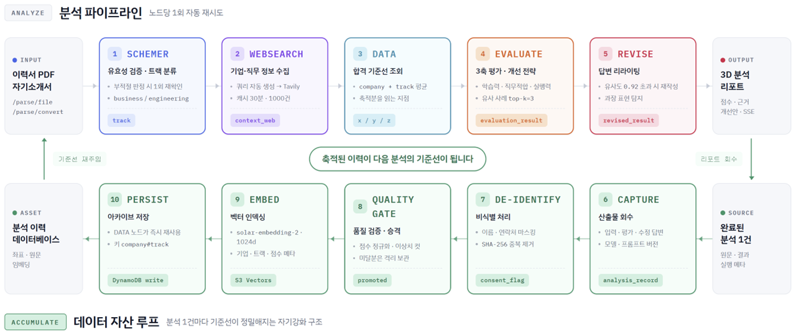

# Pertineo (KWS) — AI 기반 자기소개서 분석·커리어 지원 플랫폼

## 시스템 아키텍처

이 저장소는 프런트엔드, 코어 API, AI API를 분리한 3계층 모노레포입니다.



> **현재 통합 상태**
> `client`는 코어 API의 `POST /api/analysis`를 호출하지만, 현재 `server`의 해당 라우트는 실제 AI 서버를 호출하지 않고 `analysis-engine-unavailable` SSE 이벤트를 반환합니다. 실제 분석 엔진은 `ai-server/python`의 `POST /api/agent/analyze/stream`에 구현되어 있습니다. 따라서 전체 사용자 흐름을 완성하려면 코어 API에서 AI API로 요청과 SSE를 중계하는 프록시 계층이 필요합니다.

### 계층별 책임

| 계층 | 주요 기술 | 책임 |
| --- | --- | --- |
| `client` | React 19, React Router, React Query, Zustand, Tailwind CSS | 사용자 입력, 세션 기반 화면 보호, SSE 진행 상태 표시, 분석 리포트와 PDF 생성 |
| `server` | FastAPI, Pydantic, Structlog, Boto3 | 이메일 인증, 세션·분석 횟수, 공지·관리자 기능, CORS와 요청 로깅, 저장소 추상화 |
| `ai-server/python` | FastAPI, OpenAI SDK, Tavily, Boto3, Pydantic | 입력 파싱, 자기소개서 분석 워크플로, 벡터 검색, 채용 공고 검증·추천, 커리어 로드맵 |

이 구조에서 `server`는 사용자·권한·서비스 정책을 담당하는 **진입점/BFF**이고, `ai-server`는 외부 AI 및 검색 서비스와 데이터 소스를 조합하는 **연산 전용 서비스**입니다. 브라우저가 AI API 키나 AWS 자격 증명을 직접 다루지 않도록 모든 외부 연동은 서버 측에서 수행합니다.



AI 분석은 `StateGraphEngine`이 상태 객체를 다음 노드로 전달하는 방식으로 실행됩니다.


### 1. SCHEMER — 입력 검증

- 질문과 답변이 실제 자기소개서 형식인지 검사합니다.
- 지원자의 직군을 `engineering` 또는 `business` 트랙으로 분류합니다.
- 부적절 판정은 한 번 더 확인하여 오탐을 줄이고, 최종 실패 시 워크플로를 종료합니다.

### 2. WEBSEARCH — 최신 맥락 수집

- 지원 기업과 직무에 필요한 검색 질의를 생성합니다.
- Tavily를 통해 기업·산업·직무 정보를 수집합니다.
- 동일 기업·직무 검색 결과는 프로세스 내부 TTL 캐시에 저장합니다.

### 3. DATA — 과거 합격 기준 조회

- DynamoDB에서 동일 기업·트랙의 X/Y/Z 합격자 평균을 우선 조회합니다.
- 표본이 없으면 동일 트랙 전체 평균으로 대체합니다.
- 조회 결과는 `pass_score` SSE 이벤트로 프런트엔드에 전달됩니다.

### 4. EVALUATE — 다중 근거 평가

- 사용자 이력과 자기소개서, 웹 검색 결과, 합격자 평균을 함께 사용합니다.
- 입력 내용을 OpenAI 임베딩으로 변환하고 S3 Vectors에서 유사 문서 Top 3을 검색합니다.
- DynamoDB의 원문 문서를 조회해 평가 프롬프트의 참고 맥락으로 사용합니다.
- 3축 점수와 근거, 직무·도메인·조직·기술 적합도, 강점·약점, 개선 전략을 구조화된 응답으로 생성합니다.
- 지원자 점수와 합격자 평균의 차이는 모델이 아닌 코드에서 결정적으로 계산합니다.

### 5. REVISE — 수정안 생성

- 각 자기소개서 문항을 독립적으로 수정합니다.
- 새로운 경험이나 수치가 임의로 추가되지 않도록 원문 기반 검증을 수행합니다.
- 검증 실패 시 제한된 횟수만 재시도하고, 계속 실패하면 원문을 보존하는 안전한 결과를 반환합니다.
- 마지막에 `revise_result`, `final_state`, `workflow_completed` 이벤트를 전송합니다.

SSE 연결에는 15초 간격 heartbeat와 10분 비활성 타임아웃이 적용됩니다. 각 노드는 실패 시 상태를 이전 스냅샷으로 복구한 뒤 한 번 재시도합니다.

## 파싱 및 커리어 기능

### 스마트 파싱

`POST /api/parse/convert`는 먼저 `Q/A`, `질문/답변` 형식을 규칙 기반으로 분석합니다. 규칙으로 처리할 수 없는 입력은 OpenAI의 기본 모델로 전환하고, 설정에 따라 fallback 모델을 사용합니다.

`POST /api/parse/file`은 최대 10MB의 PDF, DOCX, TXT 파일을 받아 학력, 경력, 수상, 자격, 어학 항목을 구조화합니다.

### 채용 공고 추천

`POST /api/career/recommendations`는 다음 순서로 최대 3개의 공고를 반환합니다.

1. 이력에서 목표 직무를 추론하거나 사용자가 지정한 직무를 사용합니다.
2. Tavily로 10~20개의 후보 공고를 수집합니다.
3. 중복 URL을 제거하고 실제 페이지의 활성 상태를 확인합니다.
4. 공고의 필수·우대요건을 구조화하여 추출합니다.
5. 직무, 필수요건, 우대요건, 경력, 지역, 링크 검증 점수로 순위를 계산합니다.

`POST /api/career/company-recommendations`는 과거 합격자 X/Y/Z 평균과 표본 수, 현재 활성 공고를 결합하여 기업 적합도를 계산합니다. 이 값은 합격 확률이 아니라 **과거 합격 사례 및 현재 공고에 대한 적합도**입니다.

`POST /api/career/roadmap`은 여러 검증 공고에서 반복되는 필수·우대요건을 집계하고 현재 이력의 격차를 찾아 1·3·6·12개월 단위의 실행 계획을 생성합니다.

## 저장소 구조

```text
.
├── client/                     # React SPA
│   ├── src/api/                # Core API 클라이언트와 SSE 처리
│   ├── src/hooks/              # 분석 실행, PDF 다운로드 등
│   ├── src/pages/              # 인증·입력·로딩·분석·공지 화면
│   ├── src/stores/             # Zustand 분석 상태
│   └── src/schema/             # SSE/분석 응답 타입
│
├── server/                     # 사용자/운영 도메인 FastAPI
│   ├── app/api/                # 인증·세션·분석·공지·관리자 라우트
│   ├── app/core/               # 설정, CORS, 로깅, 예외, 미들웨어
│   ├── app/repositories/       # In-memory / DynamoDB 구현
│   ├── app/services/           # 이메일, 정적 설정 데이터
│   ├── tests/                  # API·저장소 계약 테스트
│   └── older/                  # 레거시 Spring Boot 참고 코드
│
└── ai-server/
    ├── python/                 # 현재 AI FastAPI 런타임
    │   ├── app/controllers/    # 분석·파싱·커리어 API
    │   ├── app/workflow/       # StateGraph 엔진, 상태, SSE 이벤트
    │   ├── app/workflow/nodes/ # Schemer/WebSearch/Data/Evaluate/Reviser
    │   ├── app/career/         # 공고 탐색·검증·랭킹·로드맵
    │   ├── app/vector/         # 임베딩과 S3 Vectors 검색
    │   ├── app/repository/     # 합격자 데이터 DynamoDB 접근
    │   ├── resources/          # 프롬프트와 평가 기준
    │   └── tests/              # 단위·계약 테스트
    └── src/                    # 레거시 Java/Spring 구현
```

## 주요 API

### Core API (`server`)

| Method | Endpoint | 설명 |
| --- | --- | --- |
| `GET` | `/health` | 서버 상태 확인 |
| `GET` | `/api/setup/{kind}` | 기업·직무·대학·전공 자동완성 데이터 |
| `POST` | `/api/auth/email/verification` | 이메일 인증번호 발송 |
| `POST` | `/api/auth/email/verify` | 인증번호 확인 |
| `GET` | `/api/auth/email/credit` | 남은 분석 횟수 조회 |
| `POST` | `/api/sessions/start` | 약관 동의 확인 및 세션 발급 |
| `POST` | `/api/sessions/extend` | 세션 연장 |
| `POST` | `/api/parse/convert` | 현재 코어 서버의 단순 텍스트 파싱 |
| `POST` | `/api/analysis` | 분석 SSE 진입점 — 현재 AI 엔진 미연결 |
| `GET/POST/PATCH/DELETE` | `/api/notice` | 공지사항 관리 |

### AI API (`ai-server/python`)

| Method | Endpoint | 설명 |
| --- | --- | --- |
| `POST` | `/api/agent/analyze/stream` | 전체 자기소개서 분석 워크플로와 SSE 스트림 |
| `POST` | `/api/parse/convert` | 규칙·LLM 기반 질문/답변 파싱 |
| `POST` | `/api/parse/file` | PDF/DOCX/TXT 이력서 구조화 |
| `POST` | `/api/career/recommendations` | 검증된 채용 공고 최대 3개 추천 |
| `POST` | `/api/career/company-recommendations` | 과거 합격 사례와 활성 공고 기반 기업 추천 |
| `POST` | `/api/career/roadmap` | 목표 직무·기업 커리어 로드맵 생성 |

FastAPI 실행 후 `/docs`에서 각 서비스의 OpenAPI 문서를 확인할 수 있습니다.

## 로컬 실행

### 1. Client

```bash
cd client
npm install
REACT_APP_BASE_URL=http://localhost:8001 npm start
```

기본 주소는 `http://localhost:3000`입니다. `REACT_APP_BASE_URL`에는 Core API 주소를 지정합니다.

### 2. Core API

AI 서버의 로컬 DynamoDB가 8000번 포트를 사용하므로, 세 서비스를 동시에 실행할 때는 Core API를 8001번 포트로 실행하는 것을 권장합니다.

```bash
cd server
python3 -m venv .venv
source .venv/bin/activate
pip install -e '.[dev]'
cp .env.example .env
uvicorn app.main:app --reload --port 8001
```

로컬 기본 설정은 외부 이메일을 보내지 않는 `EMAIL_DELIVERY_BACKEND=disabled`와 메모리 저장소인 `REPOSITORY_BACKEND=memory`입니다. 운영에서는 각각 `ses` 또는 `smtp`, `dynamodb`로 변경할 수 있습니다.

### 3. AI API

```bash
cd ai-server/python
python3 -m venv .venv
source .venv/bin/activate
pip install -r requirements-dev.txt
cp .env.example .env
# .env에 OPENAI_API_KEY, TAVILY_API_KEY와 AWS 설정 입력
uvicorn app.main:app --reload --port 8080
```

로컬 프로필은 `DYNAMODB_ENDPOINT=http://localhost:8000`의 DynamoDB Local을 기대합니다. Docker Compose를 사용할 경우 `.env.dev`의 endpoint를 컨테이너 서비스명으로 설정해야 합니다.

```dotenv
DYNAMODB_ENDPOINT=http://dynamodb-local:8000
```

```bash
cd ai-server/python
cp .env.example .env.dev
docker compose up --build
```

## 환경변수

민감한 값은 커밋하지 않고 각 서비스의 `.env`에만 저장합니다.

### Client

| 변수 | 설명 |
| --- | --- |
| `REACT_APP_BASE_URL` | Core API 기본 URL |
| `REACT_APP_GA_ID` | 선택적 Google Analytics ID |

### Core API

| 변수 | 설명 |
| --- | --- |
| `BACKEND_CORS_ORIGINS` | 허용할 프런트엔드 origin 목록 |
| `EMAIL_DELIVERY_BACKEND` | `disabled`, `smtp`, `ses` |
| `REPOSITORY_BACKEND` | `memory`, `dynamodb` |
| `SESSION_COOKIE_NAME` | 세션 쿠키 이름 |
| `ALLOW_ALL_EMAILS` | 모든 이메일 허용 여부 |
| `AWS_REGION` | DynamoDB·SES 리전 |

### AI API

| 변수 | 설명 |
| --- | --- |
| `OPENAI_API_KEY` | 구조화 생성, 파일 파싱, 임베딩 |
| `OPENAI_CHAT_MODEL` | 분석·커리어 생성 모델 |
| `TAVILY_API_KEY` | 웹 및 채용 공고 검색 |
| `SPRING_PROFILES_ACTIVE` | `local` 또는 `prod` |
| `AWS_REGION` | DynamoDB·S3 Vectors 리전 |
| `DYNAMODB_ENDPOINT` | 로컬 DynamoDB endpoint |
| `AWS_DYNAMODB_TABLE_*` | 합격 점수·문서 테이블 |
| `S3_VECTORS_BUCKET` | S3 Vector bucket |
| `S3_VECTORS_INDEX` | 1,536차원 OpenAI vector index |
| `LANGSMITH_API_KEY` | 선택적 워크플로 트레이싱 |

## 테스트

```bash
# Client
cd client
npm test -- --watchAll=false
npm run build

# Core API
cd server
pytest -q

# AI API
cd ai-server/python
pytest -q
```

외부 OpenAI, Tavily, DynamoDB, S3 Vectors 호출은 단위 테스트에서 mock/fake로 대체하는 것을 원칙으로 합니다.

## 현재 구현 상태 및 다음 통합 작업

| 영역 | 상태 | 비고 |
| --- | --- | --- |
| 이메일 인증·세션·공지 | 구현됨 | Core API, memory/DynamoDB 선택 가능 |
| 자기소개서 분석 엔진 | 구현됨 | AI API에서 독립 실행 가능 |
| Core → AI 분석 프록시 | **미연결** | `/api/analysis`에서 AI SSE를 중계해야 함 |
| PDF 이력서 파싱 API | 구현됨 | AI API에 존재 |
| PDF 업로드 UI → 파싱 API | **미연결** | 현재 파일 선택 후 이름만 콘솔에 기록 |
| 커리어 추천·로드맵 API | 구현됨 | AI API에 존재 |
| 커리어 기능 UI·Core 프록시 | **미연결** | 인증·호출 제한을 Core에서 적용해야 함 |

권장되는 다음 단계는 다음과 같습니다.

1. Core API에 `AI_SERVER_BASE_URL` 기반 비동기 클라이언트를 추가합니다.
2. `/api/analysis`에서 인증·크레딧 검증 후 AI 서버의 SSE를 그대로 중계합니다.
3. `/api/parse/file`과 `/api/career/*`를 Core API를 통해 노출합니다.
4. Client의 PDF 업로드와 커리어 화면을 Core API에 연결합니다.
5. Core와 AI 서버 간 내부 인증, timeout, rate limit, request ID 전파를 적용합니다.

## 보안 원칙

- API 키, AWS 자격 증명, SMTP 비밀번호는 `.env` 또는 배포 환경의 secret manager로 주입합니다.
- 브라우저에서 OpenAI, Tavily, AWS를 직접 호출하지 않습니다.
- 사용자 이력과 자기소개서 원문을 일반 로그에 기록하지 않습니다.
- 운영 환경에서는 Core API에서 인증, 호출 횟수 제한 및 rate limit을 적용합니다.
- EC2에서는 장기 AWS 키보다 IAM Role 사용을 우선합니다.
